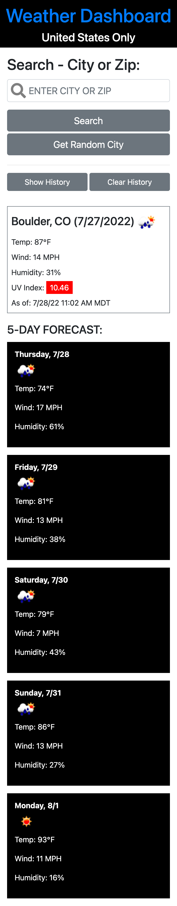

## Overview

```
As a traveler I want to see the weather outlook for multiple cities so that I can plan a trip accordingly.
```


## Index

<!-- <details><summary></summary> -->

1. [Overview](#overview)
2. [Features](#features)
3. [Future Enhancements](#future-enhancements)
2. [Acceptance Criteria](#acceptance-criteria)
4. [Technologies](#technologies)
6. [Resources](#resources)

## Features

1. Autocomplete Input: Used jQuery autocomplete utility to provide an a list of cities and locations in the search/input box.
2. Search by City or Zip: Setup API to allow user to search by either zip code or city.
3. US Only: Limited the search to U.S. locations only to apply a robust set of validation rules.
4. Tooltip: Used Bootstrap tooltip utility on the UV Index rating element as well as the weather icons.
5. Collapse: Utilized Bootstrap to collapse (show/hide) the city search history.
6. Validation: Uitilzed Bootstrap modal to validate input box input as well as for API errors.
7. UV Index: The UV rating is color coded to represent low to extreme risk based on the 
8. APIs: Utilizes an API to get the latitude/longitude based on either city or zip code input (that's 2 different APIs... the first if a city is entered and the second if a zip code is entered) then based on the latitude/longitude a third API is used to retrieve the weather forecast for today and 5 days forward.
9. Spinner: A spinner visually indicates to the system is looking for data to fulfill the search request.
10. Clear History: User can clear the entire history or by city which removes the history for the search history list and local storage respectively.
11. Random City: On load generate the weather for a random city. Also allow the user to find a random city via a button.
12. Local Storage: Used to maintain search history.

## Future Enhancements

1. Hide API Key: Use server or other options to hide the API key.
2. Current Location: Utilze the Geo API to customize the initial load to the users current location or a default location of the users choice.
3. Outside US: Include cities outside the US along with validation.
4. Validation: Continue to improve the validation.
5. Weather Data: Extend weather data to actual and historical weather (rather than just a forecast) and more granular level such as hourly or sunrise/sunset along with weather descriptive data. Add weather alert data.
6. Weather Maps: Add weather maps using google maps api.
7. Favorites: Allow user to save a list of favorate cities or a default city upon launch.
8. Multiple Locations. Provide a variety of customizable views and/or drag and drop cards so the user can customize the UX.
9. Alerts: Add weather alerts from the weather dataset. Incorporate the test to speech API to allow user to listen to the alert.
10. Cache Weather Data: Cache the results of the weather query in local storage. If data is not updated via an ETag api call or a time based conditioal (e.g. within 10 minutes of the original query), use the cache results rather than doing an additional API call.
11. Testing: Add more test data so as to avoid calling the API during testing and development.
12. Bootstrap: Refactor Bootstrap html to be more semantic and possible use a different CSS framework. According to the console coverage tab, over 95% of the Bootstrap code is not being used by this app (because Bootstrap loads the entire library vs only in-use features).
13. Minify Code: Minify all code to increase initial load speed.
14. Allow user to sort locations based on their preference (can be done with jQuery sort user interaction).

## Criteria

```
GIVEN a weather dashboard with form inputs
WHEN I search for a city
THEN I am presented with current and future conditions for that city and that city is added to the search history
WHEN I view current weather conditions for that city
THEN I am presented with the city name, the date, an icon representation of weather conditions, the temperature, the humidity, the wind speed, and the UV index
WHEN I view the UV index
THEN I am presented with a color that indicates whether the conditions are favorable, moderate, or severe
WHEN I view future weather conditions for that city
THEN I am presented with a 5-day forecast that displays the date, an icon representation of weather conditions, the temperature, the wind speed, and the humidity
WHEN I click on a city in the search history
THEN I am again presented with current and future conditions for that city
```

## Website Preview - Static Screenshot: Desktop


## Website Preview - Static Screenshot: Mobile



## Lighthouse Score:


## Technologies

1. HTML
2. CSS
3. GitHub (website hosting and source code management)
4. jQuery
5. Bootstrap (getbootstrap.com)
6. Moment

## Resources

1. GitHub Repo: <https://github.com/stevecalla/weather-dashboard>

2. GitHub Hosted URL: <https://stevecalla.github.io/weather-dashboard/>

3. Project Manager: [Steve Calla](https://github.com/stevecalla)